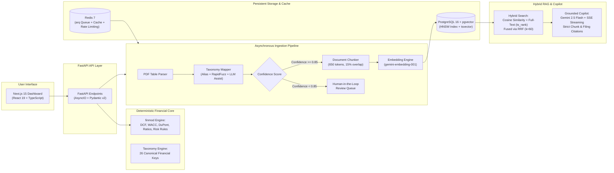

<div align="center">

# 📊 FinSight AI
### Deterministic Financial Intelligence, Due Diligence & Valuation Platform

[](https://python.org)
[](https://fastapi.tiangolo.com)
[](https://nextjs.org)
[](https://github.com/pgvector/pgvector)
[](https://redis.io)
[](LICENSE)

<p align="center">
  <b>A production-grade investment research engine:</b> Ingest SEC 10-K/10-Q filings with confidence-scored taxonomy mapping, execute deterministic financial models, query a citation-grounded RAG copilot, and generate live-formula Excel models and executive investment memos.
</p>

</div>

---

## 💡 The Core Philosophy: Deterministic Math vs. Probabilistic LLMs

In high-stakes finance, numerical hallucinations are unacceptable. **FinSight AI strictly decouples calculations from language models:**

> **The Rule**: LLMs *never* compute or forecast numbers. 
> - **Deterministic Python Engine (`finmod`)**: Computes 100% mathematically exact valuations (DCF, WACC, FCFF, DuPont, Liquidity ratios, Risk Rules).
> - **Language Models (Gemini 2.5 Flash)**: Restricted to semantic taxonomy proposal (capped at 0.75 confidence), document retrieval, and cited narrative due diligence.

---

## 🏛️ System Architecture



---

## ✨ Key Features

### 1. 🧮 Deterministic Financial Modeling (`backend/app/finmod/`)
- **Multi-Period DCF Valuation**: Enterprise Value, Equity Value, and Per-Share Fair Value calculation with flexible forecast periods, Gordon Growth terminal value, and exit multiple cross-checks.
- **Dynamic WACC Computation**: CAPM Cost of Equity, Cost of Debt (tax-shielded), and capital structure weighting.
- **Deep Ratio Analysis**: 3-stage DuPont Analysis, ROIC, Working Capital Efficiency (Cash Conversion Cycle, DSO, DIO, DPO), Interest Coverage, and Liquidity ratios.
- **Declarative Risk Rule Engine**: YAML-configured threshold scanner identifying balance sheet deterioration, margin compression, and debt concentration.

### 2. 🔍 Hybrid RAG & Financial Copilot (`backend/app/rag/`)
- **Reciprocal Rank Fusion (RRF)**: Combines dense semantic vector retrieval (pgvector HNSW cosine distance) with sparse lexical search (`ts_rank` on full-text vectors), solving the classic numerical retrieval gap.
- **Strict Citation Grounding**: Every answer links directly to the filing ID, chunk ID, section, and exact page number with confidence tracking.
- **Server-Sent Events (SSE)**: Real-time token streaming for smooth, interactive conversational analysis.

### 3. 📑 Intelligent Ingestion & HITL Review (`backend/app/ingestion/`)
- **Automated PDF Parsing**: Extracts financial tables and narrative blocks from SEC 10-K/10-Q reports.
- **Confidence Scoring & Bulk Review**: Classifies extracted items into 26 canonical taxonomy keys. Items with confidence `< 0.85` route to a Human-in-the-Loop review queue with one-click bulk approvals.
- **Asynchronous Processing**: Background job queue orchestrated via `arq` and Redis with automatic retries and failure logging.

### 4. 💻 Modern Next.js 15 Frontend (`frontend/`)
- **Sleek Financial UI**: Dark-mode glassmorphic dashboard built with React 19, TypeScript, and Tailwind CSS.
- **Interactive Modeling**: Real-time DCF sensitivity sliders (WACC & Terminal Growth flex) updating fair values and valuation bridges on the fly.
- **Visual Analytics**: Interactive multi-period charts for revenue trajectories, EBITDA margins, and DuPont breakdown.

### 5. 📦 Production Reporting & Exports (`backend/app/exports/`)
- **Live-Formula Excel Models**: FAST-standard spreadsheets recalculating live in Excel/LibreOffice to within 0.1% of API results.
- **Investment Memo PDF**: Automated institutional-grade summary memos.

---

## 🛠️ Technology Stack

| Layer | Technologies |
|---|---|
| **Backend** | Python 3.12, FastAPI, AsyncIO, SQLAlchemy 2.0, Alembic, Pydantic v2, structlog |
| **Frontend** | Next.js 15 (App Router), React 19, TypeScript, Tailwind CSS, TanStack React Query v5 |
| **Database & Search** | PostgreSQL 16, pgvector (HNSW Indexing), Full-Text Search (`tsvector`) |
| **Caching & Workers** | Redis 7, ARQ (Async Redis Queue) |
| **AI & LLM** | Google Gemini API (Gemini 2.5 Flash, Gemini Embeddings), OpenAI API adapter |
| **DevOps & Infrastructure** | Docker, Docker Compose, Caddy (Auto HTTPS/TLS), Neon Serverless Postgres |

---

## 🚀 Quickstart Guide

### Prerequisites
- [Docker & Docker Compose](https://docs.docker.com/get-docker/) installed
- (Optional) Python 3.12+ and Node.js 20+ for local development

### 1. Clone the Repository
```bash
git clone https://github.com/mahirbhat70-eng/finsight-ai.git
cd finsight-ai
```

### 2. Configure Environment
```bash
cp .env.example .env
```
*(Tests and development default to `LLM_PROVIDER=mock`. To enable live Gemini AI responses, add your free `GEMINI_API_KEY` in `.env`)*

### 3. Launch Stack via Docker Compose
```bash
docker compose up -d
```
This boots up:
- **FastAPI Backend**: `http://localhost:8000`
- **Next.js Frontend**: `http://localhost:3000`
- **PostgreSQL (pgvector)**: `localhost:5432`
- **Redis Queue**: `localhost:6379`
- **ARQ Worker**: Background ingestion runner

### 4. Initialize Database & Seed Benchmark Data
```bash
# Apply database migrations
docker exec -it finsight-ai-backend-1 alembic upgrade head

# Seed golden benchmark company (NovaTech) and financial statements
docker exec -it finsight-ai-backend-1 python scripts/seed.py
```

Open **[http://localhost:3000](http://localhost:3000)** to explore the live dashboard!

---

## 🧪 Testing & Validation

The test suite enforces strict mathematical determinism, coverage gates, and grounding thresholds:

```bash
# Run backend pytest suite (56 unit, integration, and golden tests)
docker exec -it finsight-ai-backend-1 pytest

# Validate frontend production build & TypeScript typechecks
cd frontend && npm run build
```

### Benchmark Results (NovaTech Fixtures, Seed 42)
| Test Gate | Target | Result | Status |
|---|---|---|---|
| **Ground-Truth Taxonomy Mapping** | 100% | 129/129 line items | ✅ Pass |
| **Excel Export vs API Recalculation** | < 0.2% | Within 0.1% | ✅ Pass |
| **Deterministic Unit & Golden Tests** | 100% | 56 passed, 0 failed | ✅ Pass |
| **Frontend Production Build** | Zero errors | 5/5 static pages built | ✅ Pass |

---

## 📂 Repository Structure

```text
finsight-ai/
├── backend/
│   ├── app/
│   │   ├── api/v1/        # REST endpoints (companies, metrics, valuation, copilot, review)
│   │   ├── core/          # Settings, logging, security, rate limiting, error handlers
│   │   ├── db/            # SQLAlchemy models, async session factory
│   │   ├── finmod/        # Deterministic math engine (DCF, WACC, ratios, risk rules)
│   │   ├── ingestion/     # PDF parsing, taxonomy mapper, chunker, ARQ worker
│   │   ├── llm/           # Provider adapters (Gemini, OpenAI, Mock)
│   │   └── rag/           # Hybrid retrieval (pgvector + BM25 + RRF), grounding verifier
│   └── tests/             # Pytest test suite (unit, integration, golden fixtures)
├── frontend/
│   ├── app/               # Next.js 15 app router (dashboards, valuation, copilot, review)
│   ├── components/        # UI components, interactive financial charts, tables
│   └── lib/               # Typed API client, server-sent events helper
├── data/fixtures/         # Golden benchmark corporate filing fixtures
├── scripts/               # Seed scripts, proxy utilities, eval runners
├── docker-compose.yml     # Local multi-service development compose
├── docker-compose.prod.yml# Production deployment configuration
├── Caddyfile              # Automated SSL/TLS reverse proxy configuration
└── Makefile               # Developer command shortcuts
```

---

## 📄 License
Distributed under the MIT License. See `LICENSE` for more information.
